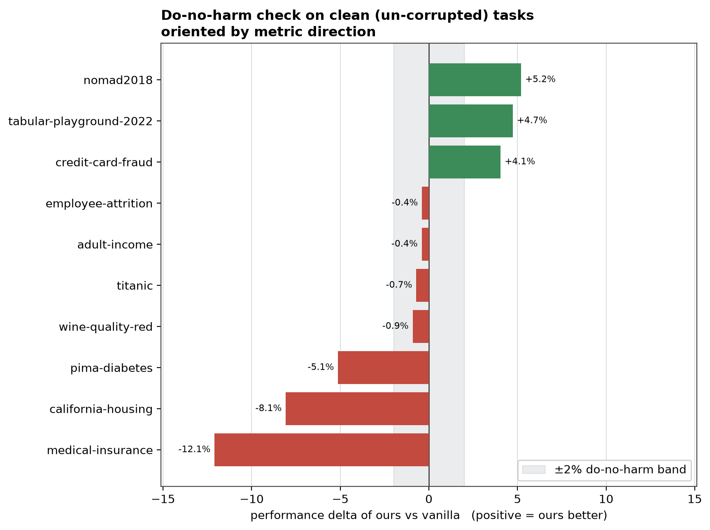
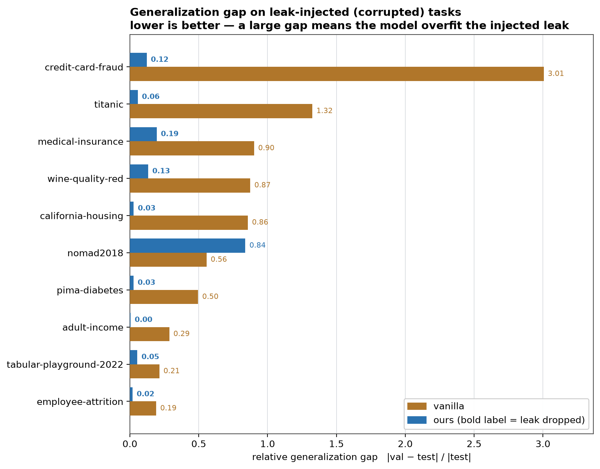
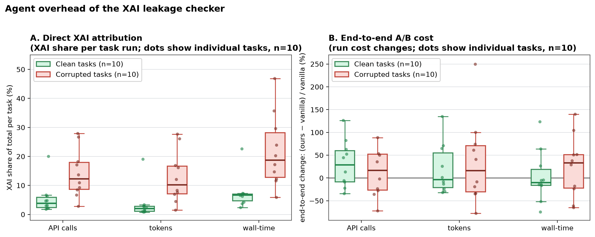

# Experiment results

# Methodology

**Objective**: To evaluate whether adding an XAI self-correction loop (an LLM-guided feature-importance audit capped at 3 iterations) to a ML pipeline can effectively detect and remove data leakage features, without degrading model performance on clean data.

**Experimental Design**: We compare two agent configurations on 10 tabular tasks from Kaggle:

1. **Baseline/Vanilla**: MLE-STAR + Skrub, with no XAI self-correction loop
2. **Ours**: MLE-STAR + Skrub + XAI self-correction loop

Each configuration is evaluated under two data conditions:

- **Clean Control**: the original, unmodified dataset
- **Corrupted Variant**: dataset with targeted injections of leakage/shortcut features

This yields four experiment groups (10 tasks each): Skrub + Clean, Skrub + Corrupted, Skrub + XAI + Clean, Skrub + XAI + Corrupted = 40 runs total.

**Core Metrics**:

| Metric | Description | Expected |
| --- | --- | --- |
| Feature-Level Detection Rate (DR_feat) | Fraction of injected leakage features correctly identified and dropped by the XAI module | 75%–90% |
| Feature-Level False Positive Rate (FPR_feat) | Fraction of legitimate features falsely flagged and removed on Clean Control | 5%–10% |
| Clean Baseline Delta (ΔPerf_clean) | Performance difference between Ours and Baseline on Clean Control, ensuring the correction loop doesn't hurt clean-data performance | ±2% |
| Generalization Gap | Gap between validation score and de-corrupted test score, indicating whether the model exploited leakage | 20%–40% reduction |
| Agent Overhead | Additional execution time and API calls introduced by the self-correction loop | +15% time, +20% API calls |

# Results

## Feature-Level Detection Rate (DR_feat) [Expected: 75%–90%]

| Task Name | Injected Feature | Flagged | Dropped |
|---|---|---|---|
| adult-income_proxy | census.wage.index | Y | Y |
| california-housing-prices_proxy | tract_price_index | Y | Y |
| credit-card-fraud_proxy | MerchantRiskIndex | Y | Y |
| employee-attrition_proxy | EngagementIndex | Y | Y |
| medical-insurance_proxy | risk_cost_index | Y | Y |
| nomad2018-predict-transparent-conductors_proxy | computed_formation_energy_ev; computed_bandgap_energy_ev | N | N |
| pima-diabetes_proxy | GlucoseRiskIndex | Y | Y |
| tabular-playground-series-may-2022_proxy | f_33 | Y | Y |
| titanic_proxy | TicketPriorityScore | Y | Y |
| wine-quality-red_proxy | palate balance index | Y | Y |

**Table: Feature-Level Detection Rate (DR_feat).** Rows = leak-injected proxy tasks; Flagged/Dropped = whether the injected feature was caught and removed. DR_feat = flagged/injected = 9/11 = 81.8%, within the 75–90% expected range. The one miss (nomad2018) is the only multi-target task in the set.

**Analysis: Injected Leakage Feature Detection**

Across the 10 proxy tasks, 9 of 11 injected features were flagged and dropped. It's tempting to attribute this to the features' suggestive names (e.g., `tract_price_index`, `GlucoseRiskIndex`), but that is not how detection actually works. A FAIL verdict is generated only when the direct probe or the proxy_probe finds sufficient statistical evidence of leakage. Name semantics play no causal role.

This is confirmed by the two exceptions. `f_33` (tabular-playground) has no suggestive name at all yet was still correctly flagged, showing detection works purely on statistical signal. `computed_formation_energy_ev` / `computed_bandgap_energy_ev` (nomad2018) have plausible scientific names but were the one detection failure — not because the names fooled the probes, but because nomad2018 is the only multi-target task in the set. Two separate leaky features each predict a different target (F1→Target_1, F2→Target_2), and the XAI module currently evaluates all targets jointly. A feature that strongly predicts only one of several targets can appear weak in the combined evaluation, so evidence never reaches the FAIL threshold. A likely fix is to run the direct/proxy_probe evaluation per target variable instead of across all targets simultaneously.

### Feature-Level False Positive Rate (FPR_feat) [Expected: 5%–10%]

- Valid Features Falsely Dropped: 1
- Total Valid Features Audited (Clean): 167
- **FPR_feat = 0.599%** (Status: OUTSIDE_RANGE — better than expected)

| Task Name | Falsely Dropped Feature(s) |
| --- | --- |
| pima-diabetes | DiabetesPedigreeFunction |

**Analysis:Feature-Level False Positive Rate**

`DiabetesPedigreeFunction` is a legitimate original feature (genetic risk score from family history), falsely dropped the clean variant. The reason is concrete, not speculative: a simple depth-3 decision tree using only this feature achieved 0.7027 validation accuracy, actually outperforming the full model's 0.6992 on this split. This confirms `DiabetesPedigreeFunction` is a genuinely strong standalone predictor, strong enough to cross the same statistical threshold the probes use to flag leakage. 

The probe (`proxy_power`) flags any feature recovering ≥95% of the full model's lift over baseline and since this feature briefly outscored the full model, its lift mathematically exceeded 100%, capping severity at max. The real issue is that this check runs on a single fixed 70/30 split with no cross-validation, so on a small dataset (768 rows) one unlucky split is enough to trigger a false max-severity flag. Averaging lift over multiple splits before comparing to the threshold would fix it.

## Clean Baseline Delta (ΔPerf_clean) [Expected: ±2%]

**Formula**: Score_Ours(Clean) − Score_Vanilla(Clean), scored on the real test set

**Figure: Clean Baseline Delta (ΔPerf_clean).** Each bar = one clean (un-corrupted) task, showing (Score_ours − Score_vanilla) on the real test set; positive = ours scored better, negative = worse. Gray band = the ±2% "do no harm" target. 6 of 10 tasks fall outside the band (3 up, 3 down).

**Analysis: Do-No-Harm Check (ΔPerf_clean)**

We traced the 6 tasks whose ΔPerf_clean fell outside the ±2% do-no-harm band back to their run logs. The run logs show this metric largely isn't measuring XAI's effect. For 5 of 6 tasks checked (california-housing, medical-insurance, credit-card-fraud, tabular-playground, nomad2018), `xai_loop_count` is 0 and `xai_action_history` is empty on both models — XAI took zero corrective actions and passed immediately. Yet baseline and XAI-enabled `submission_code` are entirely different programs each run, because the pipeline is an LLM-agent search that regenerates a new candidate solution every time. Both the gains and the regressions in these 5 tasks are run-to-run search variance, not an effect of XAI,  and XAI staying hands-off here matches the 0.599% feature-level FPR measured elsewhere. 

The one exception is pima-diabetes (`xai_loop_count_1` = 3, first-pass verdict FAIL), the only confirmed harm case: a legitimate, strongly predictive feature (`DiabetesPedigreeFunction`) was falsely dropped.

**Takeaway**: the ±2% band isn't met in raw numbers, but that's mostly measurement noise from comparing independent runs, not XAI-induced harm, only pima-diabetes is a real case worth addressing.

## Generalization Gap Reduction [Expected Reduction: 20%–40%]

**Formula:** Gap = |Score_val − Score_test_clean| / |test| 

**Figure: Generalization Gap Reduction.** Each pair of bars = one leak-injected task; gap = |val − test| / |test| (relative, not absolute), lower is better. Orange = vanilla (no XAI), blue = ours; 9/10 tasks show ours far below vanilla,credit-card-fraud drops from 3.01 to 0.12. The one flip, nomad2018 (0.84 vs 0.56), is the only task where the leak was never detected in either run, so the gap didn't shrink at all.

**Analysis: Generalization Gap on Leak-Injected Tasks**

The one exception is nomad2018, this matches the earlier finding: as the only multi-target task, XAI's joint evaluation diluted the leak signal, so it went undetected in both runs (verdict=PASS, never flagged or dropped), no correction was attempted in either. The worse gap comes from how each run used the un-removed leak: vanilla engineered it into ratio features, ours used it raw, baking the leak in more directly and widening the val/test mismatch. This split in usage is itself just run-to-run search variance, not a controllable or reproducible pattern, the real fix is upstream, at detection: if the leak had been caught in the first place, how each run might have engineered features from it would be moot.

The chart above shows raw gap values, not the reduction percentage implied by "Expected: 20%–40% reduction." The table below adds that missing number for each task.

| Task | Reduction |
|---|---|
| adult-income | 100.0% |
| california-housing | 96.5% |
| credit-card-fraud | 96.0% |
| titanic | 95.5% |
| pima-diabetes | 94.0% |
| wine-quality-red | 85.1% |
| employee-attrition | 89.5% |
| medical-insurance | 78.9% |
| tabular-playground-2022 | 76.2% |
| nomad2018 | −50.0% |

**Result:** 9 of 10 tasks beat the 20%–40% expected reduction by a wide margin, landing at 76%–100% instead, the leak was nearly or fully eliminated, not just reduced. The one exception, nomad2018, didn't reduce the gap at all; it got 50% worse, since the leak was never detected.

## Agent Overhead (Direct Attribution & A/B Diff)

**Figure: Agent overhead of the XAI leakage checker.** Each dot = one task (n=20: 10 clean, 10 corrupted). Left plot (Profiling): What percentage of the new system's total budget was spent inside the XAI checker? Right plot (A/B change): How much more (or less) expensive is the new system overall compared to the baseline (vanilla) system?

**Analysis: Agent Overhead**

Reading directly off Panel A: clean tasks median 3.9% calls, 2.0% tokens, 6.7% time; corrupted tasks median 12.3% calls, 10.2% tokens, 18.7% time. Clean tasks cost less because most have nothing to detect, corrupted tasks cost more because XAI usually finds and removes the injected leak.

Two tasks are notable exceptions to that pattern:`pima-diabetes` (clean) cost about as much as a corrupted task, since a false positive pulled it into a 3-round correction loop on `DiabetesPedigreeFunction`; `nomad2018_proxy` (corrupted) cost about as little as a clean task, since the leak went undetected and XAI only ran its 2-call audit. 

Panel B (end-to-end A/B cost) splits the same way: clean tasks median +28.8% calls, −3.7% tokens, −10.0% time; corrupted tasks median +16.6% calls, +16.1% tokens, +33.3% time. Calls and tokens don't move together because they're not the same unit — calls counts are small (tens to low hundreds), so a handful of extra round-trips swings the percentage a lot; tokens counts are large (hundreds of thousands), so the same extra round-trips barely register as a percentage. This is why credit-card-fraud, for example, shows +44.4% calls but −29.6% tokens in the same run, more back-and-forth exchanges, each one shorter on average, not a uniform "more expensive" run.

These medians also hide individual-task swings that cancel out at the group level, medical-insurance (clean) alone jumped +82.3% calls, +64.7% tokens, +63.7% time, tracing to 3 code-generation bugs needing debug/retry in the "ours" run versus vanilla's 1 (each retry costs an extra LLM call, extra tokens, extra time); other clean tasks like california-housing (time −74.7%) pulled the opposite way, which is why the group median lands near 0 for tokens/time despite tasks like medical-insurance rising sharply. Corrupted tasks run higher on tokens/time too, plausibly reflecting the extra work of actually finding and removing a leak, though the same retry-variance caveat applies there. Calls and tokens swing from about −75% to beyond +250% per task, while wall-time swings somewhat less dramatically, from about −75% to +140%, search variance dominating on top of these floors. Individual tasks can spike far higher than the medians suggest, e.g. wine-quality-red_proxy (+255% calls), credit-card-fraud_proxy (+104.4% time). So treat these medians as typical overhead, not a worst-case guarantee.

# **Conclusion**

The results so far are broadly in line with what this system was designed to do, it catches leaks it should, and it doesn't wrongly flag features that are actually fine, and even the cases where it does get something wrong (the missed leak on nomad2018, the false positive on pima-diabetes) turn out to be solvable rather than dead ends. When we looked into why those two cases actually failed, we found more than one problem: the proxy_power probe only checks a single train/val split, so it can get unlucky on small datasets; it evaluates all targets jointly instead of one at a time, which is why it missed nomad2018; and it has no way to catch leaks that only show up when features are combined. Leakage can take a lot of different forms, and we need more experiments to see how well the current approach generalizes across them, which these experiments can't answer. So the overall numbers look better than the detection logic actually is right now, and there's more work needed than the headline stats suggest.
Separately, we also checked how the pipeline uses skrub throughout these runs, and it worked correctly as expected.

# **Future Work**

Evaluate probes per target instead of jointly, to fix multi-target misses like nomad2018. 

Replace `proxy_power`'s single fixed 70/30 split with a cross-validated lift_fraction estimate, so one unlucky split can't manufacture a false max-severity flag like it did on `DiabetesPedigreeFunction`. 

Add a probe for combination/interaction-based leaks, since `direct` and `proxy_power` only test one feature at a time. 

Profile high-overhead trigger cases to cap tail-case cost.
